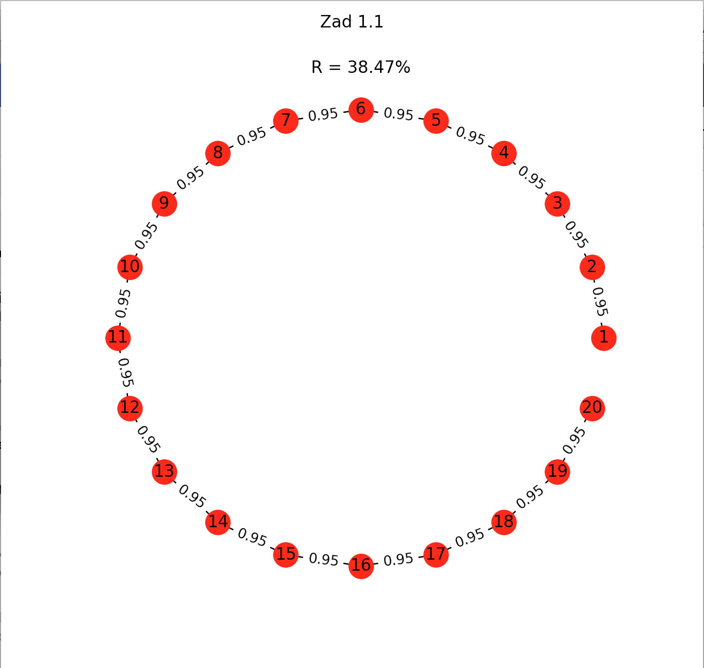
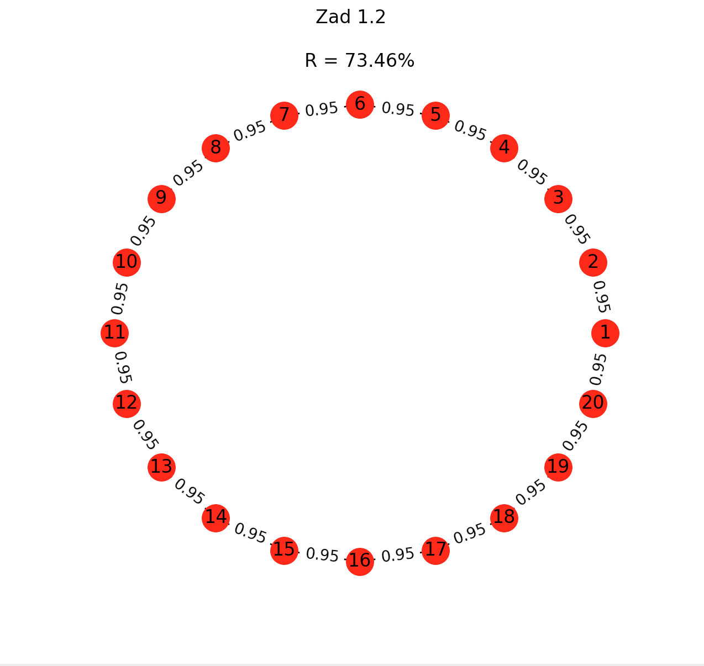
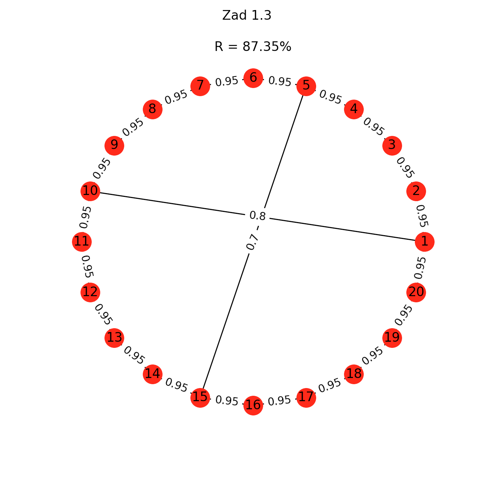
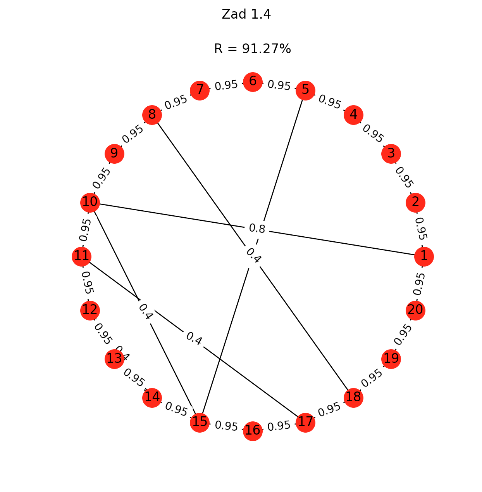
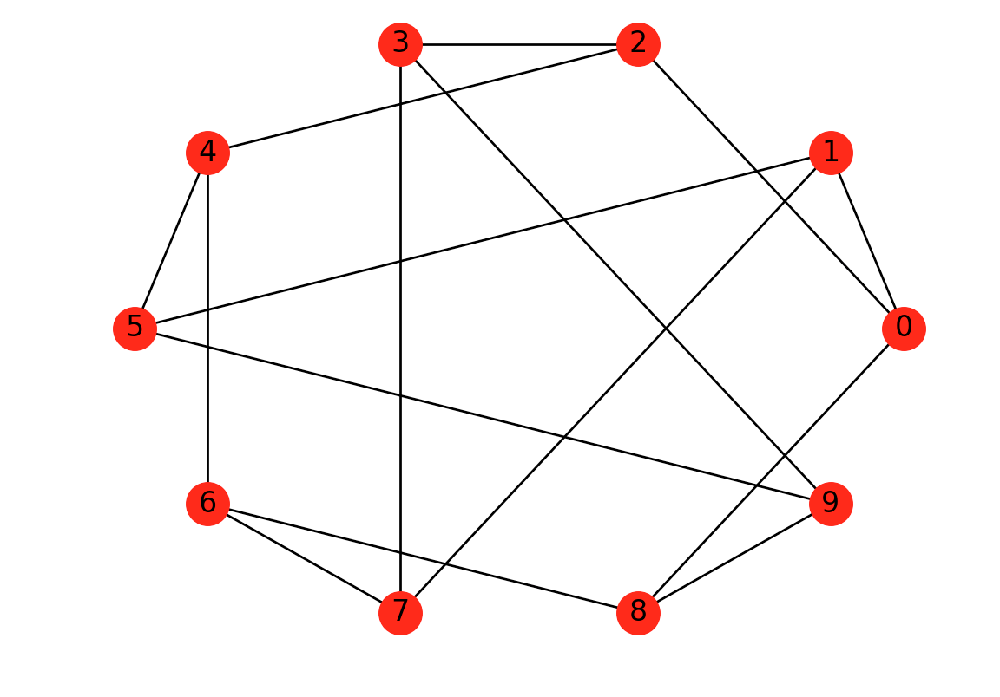

Lista 2
===

Zadanie 1
---
Dla każdego podpunktu przeprowadziłem próbę spójności metodą Monte Carlo, dla 10000 prób

Wagi na krawędziach oznaczają niezawodność danej krawędzi

### 1.1
Wyznaczona niezawodność: 38.47%


### 1.2
Wyznaczona niezawodność: 73.46%


### 1.3
Wyznaczona niezawodność: 87.35%


### 1.4
Wyznaczona niezawodność: 91.27%


Zadanie 2
---
Przyjąłem wielkość pakietu: `8 bitów`

Topologia sieci: (Graf Petersena)


Wyjściowa macierz N:
```
[[ 0 64 64 64 64 64 64 64 64 64]
 [64  0 64 64 64 64 64 64 64 64]
 [64 64  0 64 64 64 64 64 64 64]
 [64 64 64  0 64 64 64 64 64 64]
 [64 64 64 64  0 64 64 64 64 64]
 [64 64 64 64 64  0 64 64 64 64]
 [64 64 64 64 64 64  0 64 64 64]
 [64 64 64 64 64 64 64  0 64 64]
 [64 64 64 64 64 64 64 64  0 64]
 [64 64 64 64 64 64 64 64 64  0]]
```

Wyjściowa macierz C:
```
[[   0 4096 4096    0    0    0    0    0 4096    0]
 [4096    0    0    0    0 4096    0 4096    0    0]
 [4096    0    0 4096 4096    0    0    0    0    0]
 [   0    0 4096    0    0    0    0 4096    0 4096]
 [   0    0 4096    0    0 4096 4096    0    0    0]
 [   0 4096    0    0 4096    0    0    0    0 4096]
 [   0    0    0    0 4096    0    0 4096 4096    0]
 [   0 4096    0 4096    0    0 4096    0    0    0]
 [4096    0    0    0    0    0 4096    0    0 4096]
 [   0    0    0 4096    0 4096    0    0 4096    0]]
```

Wyjściowa macierz A:
```
[[  0 320 320   0   0   0   0   0 320   0]
 [320   0   0   0   0 320   0 320   0   0]
 [320   0   0 320 320   0   0   0   0   0]
 [  0   0 320   0   0   0   0 320   0 320]
 [  0   0 320   0   0 320 320   0   0   0]
 [  0 320   0   0 320   0   0   0   0 320]
 [  0   0   0   0 320   0   0 320 320   0]
 [  0 320   0 320   0   0 320   0   0   0]
 [320   0   0   0   0   0 320   0   0 320]
 [  0   0   0 320   0 320   0   0 320   0]]
```

Opóźnienie dla podstawowej topologii: `T = 0.87%`

Przyjmijmy, że `T_max` będzie równe `T_max = 1.1 * T`
Prawdopodobieństwo zerwania krawędzi `p = 0.9`

```
Reliability: 98.83%
```

Tak wysoka niezawodność jest związana z wysoką spójnością grafu Petersena.